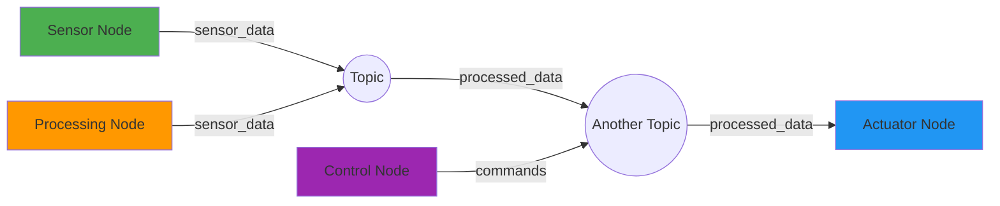

# Chapter 1: ROS 2 Architecture & Setup

## Introduction

Welcome to the world of ROS 2 (Robot Operating System 2), the middleware that serves as the nervous system for Physical AI systems. In Module 1, you learned about Physical AI and how intelligent agents interact with the real world through sensors and actuators. Now, we'll dive into ROS 2, which enables these interactions by connecting perception, AI reasoning, and actuation through a distributed architecture.

ROS 2 is not just a software framework; it's a complete ecosystem that allows multiple processes (called "nodes") to communicate with each other seamlessly. Whether you're controlling a humanoid robot's movements, processing sensor data, or making high-level decisions, ROS 2 provides the communication infrastructure that ties everything together.

If you recall from Module 1, Physical AI systems require tight integration between perception (sensors), reasoning (AI), and action (actuators). ROS 2 serves as the middleware that enables this integration by allowing different software components to communicate seamlessly, regardless of which computer they're running on or which programming language they're written in.

This chapter will guide you through setting up ROS 2 on your system and understanding its fundamental architecture. By the end of this chapter, you'll have a working ROS 2 environment and understand the core concepts that make distributed robotics possible.

## Core Concepts

### ROS 2 Philosophy and Design Goals

ROS 2 was designed to address the limitations of its predecessor, ROS 1, particularly in the areas of real-time performance, security, and multi-robot systems. The key design goals include:

- **Real-time performance**: ROS 2 uses DDS (Data Distribution Service) as its communication layer, providing better real-time capabilities
- **Security**: Built-in security features including authentication, encryption, and access control
- **Multi-robot support**: Better support for coordinating multiple robots in the same system
- **Production readiness**: Designed for commercial and industrial applications
- **Platform independence**: Runs on various operating systems including Linux, Windows, and macOS

### Nodes and Graph-Based Execution

In ROS 2, a **node** is a process that performs computation. Nodes are the fundamental building blocks of a ROS program, and they can be written in different programming languages (Python, C++, etc.). Each node can publish data to or subscribe to data from different **topics**.

The collection of nodes and their connections forms the **ROS graph** - a dynamic, distributed network of processes that communicate with each other. This graph-based execution model allows for:

- **Decoupling**: Nodes don't need to know about each other directly
- **Flexibility**: Nodes can be added, removed, or replaced without affecting others
- **Scalability**: Systems can grow from single robots to fleets of robots

### DDS vs Traditional Client/Server

ROS 2 uses DDS (Data Distribution Service) as its underlying communication middleware, which differs significantly from traditional client/server architectures:

**Traditional Client/Server:**
- Direct connections between specific clients and servers
- Request/response model
- Tight coupling between components
- Difficult to scale and maintain

**DDS (Data-Centric Approach):**
- Anonymous communication through topics
- Publish/subscribe model with data availability
- Loose coupling - publishers don't know about subscribers
- Better scalability and flexibility
- Built-in Quality of Service (QoS) policies

### Workspaces and Packages

A **workspace** in ROS 2 is a directory where you develop and build ROS 2 packages. The typical structure includes:

- `src/` - Source code for packages
- `build/` - Build artifacts
- `install/` - Installation directory
- `log/` - Log files

A **package** is the basic building and distribution unit in ROS 2. Each package contains:

- Source code (Python, C++, etc.)
- Configuration files
- Launch files
- Documentation
- Dependencies specification

### ROS 2 CLI Tools

ROS 2 provides a comprehensive set of command-line tools for development and debugging:

- `ros2 run` - Run a node from a package
- `ros2 topic` - List, echo, publish, and info about topics
- `ros2 service` - List, call services
- `ros2 action` - List, send goals to actions
- `ros2 node` - List nodes and info about them
- `ros2 pkg` - Create, list, and find packages
- `ros2 launch` - Run launch files

### ROS Graph Visualization

The ROS 2 graph represents the dynamic network of nodes communicating with each other. Here's a visualization of how nodes interact through topics:



In this diagram:
- Green: Sensor Node publishing sensor data
- Orange: Processing Node subscribing to sensor data and publishing processed data
- Blue: Actuator Node subscribing to processed data
- Purple: Control Node publishing commands
- Circles: Topics facilitating communication between nodes

## Examples

### Installing ROS 2 Humble Hawksbill

This section provides complete installation steps for ROS 2 Humble Hawksbill on Ubuntu 22.04:

1. **Set locale**:
   ```bash
   locale  # check for UTF-8
   sudo apt update && sudo apt install locales
   sudo locale-gen en_US.UTF-8
   sudo update-locale LC_ALL=en_US.UTF-8 LANG=en_US.UTF-8
   export LANG=en_US.UTF-8
   ```

2. **Setup sources**:
   ```bash
   sudo apt install software-properties-common
   sudo add-apt-repository universe
   sudo apt update && sudo apt install curl gnupg lsb-release
   sudo curl -sSL https://raw.githubusercontent.com/ros/rosdistro/master/ros.key -o /usr/share/keyrings/ros-archive-keyring.gpg
   echo "deb [arch=$(dpkg --print-architecture) signed-by=/usr/share/keyrings/ros-archive-keyring.gpg] http://packages.ros.org/ros2/ubuntu $(lsb_release -cs) main" | sudo tee /etc/apt/sources.list.d/ros2.list > /dev/null
   ```

3. **Install ROS 2 packages**:
   ```bash
   sudo apt update
   sudo apt install ros-humble-desktop
   ```

4. **Environment setup**:
   ```bash
   echo "source /opt/ros/humble/setup.bash" >> ~/.bashrc
   source ~/.bashrc
   ```

5. **Install additional tools**:
   ```bash
   sudo apt install python3-colcon-common-extensions
   sudo apt install python3-rosdep
   sudo rosdep init
   rosdep update
   ```

### Creating and Building a Python Workspace

Let's create a workspace for our ROS 2 Python packages:

1. **Create workspace directory**:
   ```bash
   mkdir -p ~/ros2_ws/src
   cd ~/ros2_ws
   ```

2. **Create a simple Python package**:
   ```bash
   cd ~/ros2_ws/src
   ros2 pkg create --build-type ament_python my_first_ros2_pkg
   ```

3. **Build the workspace**:
   ```bash
   cd ~/ros2_ws
   colcon build --packages-select my_first_ros2_pkg
   ```

4. **Source the workspace**:
   ```bash
   source ~/ros2_ws/install/setup.bash
   ```

### Running a Sample Node

Let's run a sample node using the `ros2 run` command:

1. **Source ROS 2**:
   ```bash
   source /opt/ros/humble/setup.bash
   ```

2. **Source your workspace** (if you created one):
   ```bash
   source ~/ros2_ws/install/setup.bash
   ```

3. **Run a sample node** (for example, the turtlesim node):
   ```bash
   ros2 run turtlesim turtlesim_node
   ```

### Troubleshooting Tips

Here are common issues you might encounter during installation and setup:

**Issue: "command not found" when running ROS 2 commands**
- **Solution**: Make sure you've sourced the ROS 2 setup file: `source /opt/ros/humble/setup.bash`

**Issue: Permission denied errors during installation**
- **Solution**: Make sure you're using `sudo` for system-wide installations: `sudo apt install ...`

**Issue: Python package import errors**
- **Solution**: Make sure you've installed the Python extensions: `sudo apt install python3-colcon-common-extensions`

**Issue: Workspace not building**
- **Solution**: Make sure you're in the correct workspace directory and that you've properly created the `src` directory: `mkdir -p ~/ros2_ws/src`

## Summary & Key Takeaways

In this chapter, you've learned the foundational concepts of ROS 2:

- **ROS 2** serves as the nervous system for Physical AI systems, connecting perception, reasoning, and actuation
- **Nodes** are processes that perform computation and communicate through the ROS graph
- **DDS** provides a data-centric communication approach that's more flexible than traditional client/server
- **Workspaces and packages** organize your ROS 2 development
- **CLI tools** help you develop, debug, and manage your ROS 2 systems

You've also successfully installed ROS 2 Humble Hawksbill and created your first workspace. These foundational skills will be essential as we dive deeper into creating nodes, topics, and other ROS 2 communication patterns in the next chapters.

In the next chapter, we'll explore how nodes communicate with each other through topics, messages, services, and actions - the core communication primitives that make distributed robotics possible.