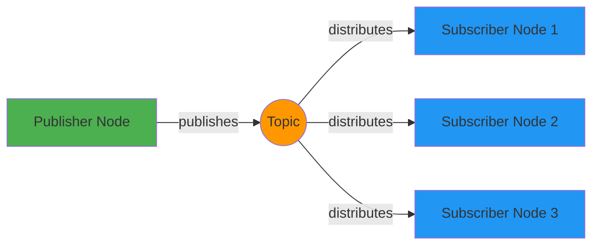

# Chapter 2: Nodes, Topics, and Messages

## Introduction

In Chapter 1, you learned about ROS 2 as the nervous system for Physical AI systems and set up your development environment. Now we'll dive deeper into the fundamental communication patterns that make distributed robotics possible: nodes, topics, and messages.

Recall from Module 1 that Physical AI systems require tight integration between perception (sensors), reasoning (AI), and action (actuators). In the context of ROS 2, think of nodes as specialized brain regions, each responsible for a specific function. For example, one node might process camera data to detect objects (perception), another might plan navigation paths (reasoning), and a third might control the robot's motors (actuation). These nodes need to communicate with each other seamlessly, sharing sensor data, commands, and status updates. This is where topics and messages come in - they provide the communication channels and the format for the information being shared, enabling the tight integration between perception, reasoning, and actuation that defines Physical AI systems.

By the end of this chapter, you'll understand how to create nodes that publish and subscribe to topics, how to define custom message types, and how to use ROS 2 command-line tools to inspect the communication happening in your robot system.

## Core Concepts

### Nodes as Processes

A **node** in ROS 2 is a process that performs computation. It's the fundamental building block of a ROS program. In Python, nodes are implemented by extending the `rclpy.node.Node` class. Each node can:

- Publish data to topics
- Subscribe to data from topics
- Provide services
- Act as a client to services
- Execute actions

Nodes are designed to be modular and independent. This means you can develop, test, and debug each node separately, then combine them to create complex robotic systems. This modularity is crucial for Physical AI systems where different components (perception, reasoning, actuation) might be developed by different teams or even run on different computers.

### Topics as Data Streams

A **topic** is a named channel through which nodes exchange messages. Topics use a publish-subscribe communication pattern where:

- **Publishers** send messages to a topic
- **Subscribers** receive messages from a topic
- Multiple publishers can send to the same topic
- Multiple subscribers can receive from the same topic

This decoupled communication means publishers don't need to know about subscribers and vice versa. This loose coupling makes systems more flexible and robust.

### Publishers and Subscribers

The **publisher-subscriber** pattern is the most common communication method in ROS 2:

- **Publishers** create and send messages to topics
- **Subscribers** receive messages from topics
- Communication is asynchronous - publishers and subscribers don't need to run simultaneously
- Messages are distributed to all subscribers on a topic

This pattern is ideal for sensor data distribution, status updates, and other continuous data streams.

### Message Types and Structure

**Messages** are the data structures that flow between nodes through topics. Each message type has a specific structure defined in a `.msg` file. Common built-in message types include:

- `std_msgs/msg/String` - Simple string messages
- `std_msgs/msg/Int32` - 32-bit integer messages
- `geometry_msgs/msg/Twist` - Velocity commands for robots
- `sensor_msgs/msg/JointState` - Joint position, velocity, and effort information

Message types are strongly typed, ensuring that nodes exchange compatible data. You can also define custom message types for your specific application needs.

## Examples

### Python rclpy Publisher Example

Let's create a simple publisher node that publishes messages to a topic:

```python
# publisher_member_function.py
import rclpy
from rclpy.node import Node
from std_msgs.msg import String


class MinimalPublisher(Node):

    def __init__(self):
        super().__init__('minimal_publisher')
        self.publisher_ = self.create_publisher(String, 'topic', 10)
        timer_period = 0.5  # seconds
        self.timer = self.create_timer(timer_period, self.timer_callback)
        self.i = 0

    def timer_callback(self):
        msg = String()
        msg.data = 'Hello World: %d' % self.i
        self.publisher_.publish(msg)
        self.get_logger().info('Publishing: "%s"' % msg.data)
        self.i += 1


def main(args=None):
    rclpy.init(args=args)

    minimal_publisher = MinimalPublisher()

    rclpy.spin(minimal_publisher)

    # Destroy the node explicitly
    minimal_publisher.destroy_node()
    rclpy.shutdown()


if __name__ == '__main__':
    main()
```

### Python rclpy Subscriber Example

Now let's create a subscriber node that receives messages from the same topic:

```python
# subscriber_member_function.py
import rclpy
from rclpy.node import Node
from std_msgs.msg import String


class MinimalSubscriber(Node):

    def __init__(self):
        super().__init__('minimal_subscriber')
        self.subscription = self.create_subscription(
            String,
            'topic',
            self.listener_callback,
            10)
        self.subscription  # prevent unused variable warning

    def listener_callback(self, msg):
        self.get_logger().info('I heard: "%s"' % msg.data)


def main(args=None):
    rclpy.init(args=args)

    minimal_subscriber = MinimalSubscriber()

    rclpy.spin(minimal_subscriber)

    # Destroy the node explicitly
    minimal_subscriber.destroy_node()
    rclpy.shutdown()


if __name__ == '__main__':
    main()
```

### Running Publisher and Subscriber

To run these nodes, save them in a ROS 2 package and execute:

1. **Run the publisher**:
   ```bash
   ros2 run your_package_name publisher_member_function
   ```

2. **In a new terminal, run the subscriber**:
   ```bash
   ros2 run your_package_name subscriber_member_function
   ```

### Custom Message Type Example

To create a custom message type, create a file called `Num.msg` in the `msg/` directory of your package:

```
int64 num
```

Then add the message dependency to your `package.xml`:

```xml
<depend>builtin_interfaces</depend>
<member_of_group>rosidl_interface_packages</member_of_group>
```

And update your `setup.py` to include the message:

```python
from setuptools import setup
from glob import glob
import os

package_name = 'your_package_name'

setup(
    # ... other setup parameters ...
    data_files=[
        # ... other data files ...
        (os.path.join('share', package_name), glob('msg/*.msg')),
    ],
    # ... rest of setup ...
)
```

### Topic Introspection Using CLI

ROS 2 provides powerful command-line tools to inspect topics:

1. **List all topics**:
   ```bash
   ros2 topic list
   ```

2. **Get info about a specific topic**:
   ```bash
   ros2 topic info /topic
   ```

3. **Echo messages from a topic**:
   ```bash
   ros2 topic echo /topic std_msgs/msg/String
   ```

4. **Publish to a topic directly**:
   ```bash
   ros2 topic pub /topic std_msgs/msg/String "data: 'Hello from CLI'"
   ```

### ROS Graph Visualization

Here's a visualization of the publisher-subscriber pattern:



In this diagram:
- Green: Publisher Node sending messages
- Orange: Topic channel distributing messages
- Blue: Subscriber Nodes receiving messages

## Summary & Key Takeaways

In this chapter, you've learned about the fundamental communication patterns in ROS 2:

- **Nodes** are processes that perform computation and serve as the building blocks of ROS 2 systems
- **Topics** are named channels for asynchronous message passing between nodes
- **Publishers** send messages to topics, and **subscribers** receive messages from topics
- **Messages** are strongly-typed data structures that flow between nodes
- The publish-subscribe pattern enables loose coupling and flexible system design

You've also learned how to create publisher and subscriber nodes in Python using `rclpy`, how to define custom message types, and how to use ROS 2 command-line tools for topic introspection.

In the next chapter, we'll explore services and actions, which provide different communication patterns for request-response interactions and long-running tasks respectively. These patterns complement topics and messages to provide a complete communication toolkit for robotics applications.