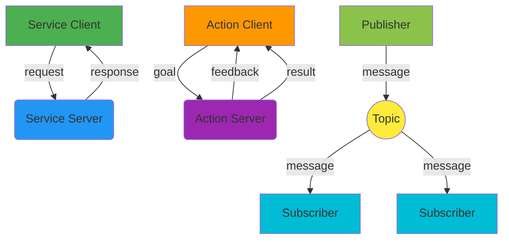

# Chapter 3: Services, Actions, and Launch Files

## Introduction

In the previous chapter, you learned about topics and messages, which enable asynchronous, decoupled communication between ROS 2 nodes. While topics are excellent for continuous data streams like sensor readings or status updates, many robotic applications require different communication patterns.

As we discussed in Module 1, Physical AI systems must integrate perception, reasoning, and actuation in complex ways. Sometimes you need synchronous request-response interactions, like asking a service to compute an inverse kinematics solution. Other times you need to manage long-running tasks with feedback, such as navigating to a goal location while providing progress updates. Additionally, managing multiple nodes simultaneously requires orchestration tools.

This chapter introduces services for request-response communication, actions for goal-oriented long-running tasks, and launch files for managing complex systems. These communication patterns complement topics and messages to provide a complete toolkit for robotics applications.

## Core Concepts

### Services (Request/Response)

**Services** provide a synchronous, request-response communication pattern between nodes. Unlike topics which are asynchronous and decoupled, services create a direct connection between a client and a server for a specific request. The communication flow is:

1. A **service client** sends a request to a **service server**
2. The service server processes the request
3. The service server sends a response back to the client
4. The client receives the response and continues execution

This pattern is ideal for operations that:
- Have a clear input and output
- Should complete relatively quickly
- Require guaranteed delivery and response
- Need to return computed results

### Actions (Goal-Based Long Tasks)

**Actions** are designed for long-running tasks that require feedback and status updates. Unlike services which are synchronous and expected to complete quickly, actions can run for extended periods. The action pattern includes:

- **Goals**: Requests for long-running tasks
- **Feedback**: Periodic updates on task progress
- **Results**: Final outcome when the task completes
- **Status**: Current state of the goal (active, canceled, succeeded, etc.)

Actions are perfect for tasks like:
- Navigation to a goal location
- Trajectory execution
- Image processing jobs
- Any task that needs to report progress

### Launch Files (Python/YAML)

**Launch files** provide a way to start multiple nodes and configure the system with a single command. Instead of manually starting each node in separate terminals, launch files allow you to:

- Start multiple nodes simultaneously
- Configure parameters for each node
- Set up remappings
- Manage complex system orchestration
- Handle dependencies between nodes

Launch files can be written in Python or YAML format, with Python providing more flexibility and YAML offering simplicity for basic configurations.

### Parameters and Configuration

ROS 2 provides a robust parameter system that allows nodes to be configured at runtime. Parameters can be:

- Declared within nodes
- Set at launch time via launch files
- Modified dynamically during execution
- Loaded from configuration files
- Passed as command-line arguments

This system enables the same node to behave differently in simulation vs. real hardware, or to adapt to different environments without code changes.

## Examples

### Python Service Server Example

Here's a simple service server that adds two integers:

```python
# service_member_function.py
import sys
import rclpy
from rclpy.node import Node
from example_interfaces.srv import AddTwoInts


class MinimalService(Node):

    def __init__(self):
        super().__init__('minimal_service')
        self.srv = self.create_service(AddTwoInts, 'add_two_ints', self.add_two_ints_callback)

    def add_two_ints_callback(self, request, response):
        response.sum = request.a + request.b
        self.get_logger().info('Incoming request\na: %d b: %d' % (request.a, request.b))
        return response


def main(args=None):
    rclpy.init(args=args)

    minimal_service = MinimalService()

    rclpy.spin(minimal_service)

    rclpy.shutdown()


if __name__ == '__main__':
    main()
```

### Python Service Client Example

And here's a client that calls the service:

```python
# client_member_function.py
import sys
import rclpy
from rclpy.node import Node
from example_interfaces.srv import AddTwoInts


class MinimalClientAsync(Node):

    def __init__(self):
        super().__init__('minimal_client_async')
        self.cli = self.create_client(AddTwoInts, 'add_two_ints')
        while not self.cli.wait_for_service(timeout_sec=1.0):
            self.get_logger().info('service not available, waiting again...')
        self.req = AddTwoInts.Request()

    def send_request(self, a, b):
        self.req.a = a
        self.req.b = b
        self.future = self.cli.call_async(self.req)
        rclpy.spin_until_future_complete(self, self.future)
        return self.future.result()


def main(args=None):
    rclpy.init(args=args)

    minimal_client = MinimalClientAsync()
    response = minimal_client.send_request(int(sys.argv[1]), int(sys.argv[2]))
    minimal_client.get_logger().info(
        'Result of add_two_ints: for %d + %d = %d' %
        (int(sys.argv[1]), int(sys.argv[2]), response.sum))

    minimal_client.destroy_node()
    rclpy.shutdown()


if __name__ == '__main__':
    main()
```

### Action Server Example

Here's a Fibonacci action server that generates a sequence:

```python
# action_server.py
#!/usr/bin/env python3

import time
import rclpy
from rclpy.action import ActionServer, CancelResponse, GoalResponse
from rclpy.callback_groups import ReentrantCallbackGroup
from rclpy.executors import MultiThreadedExecutor
from rclpy.node import Node

from example_interfaces.action import Fibonacci


class FibonacciActionServer(Node):

    def __init__(self):
        super().__init__('fibonacci_action_server')
        self._action_server = ActionServer(
            self,
            Fibonacci,
            'fibonacci',
            execute_callback=self.execute_callback,
            callback_group=ReentrantCallbackGroup(),
            goal_callback=self.goal_callback,
            cancel_callback=self.cancel_callback)

    def destroy(self):
        self._action_server.destroy()
        super().destroy_node()

    def goal_callback(self, goal_request):
        self.get_logger().info('Received goal request')
        return GoalResponse.ACCEPT

    def cancel_callback(self, goal_handle):
        self.get_logger().info('Received cancel request')
        return CancelResponse.ACCEPT

    async def execute_callback(self, goal_handle):
        self.get_logger().info('Executing goal...')

        feedback_msg = Fibonacci.Feedback()
        feedback_msg.sequence = [0, 1]

        for i in range(1, goal_handle.request.order):
            if goal_handle.is_cancel_requested:
                goal_handle.canceled()
                self.get_logger().info('Goal canceled')
                return Fibonacci.Result()

            feedback_msg.sequence.append(feedback_msg.sequence[i] + feedback_msg.sequence[i-1])
            self.get_logger().info(f'Feedback: {feedback_msg.sequence}')
            goal_handle.publish_feedback(feedback_msg)
            time.sleep(1)

        goal_handle.succeed()
        result = Fibonacci.Result()
        result.sequence = feedback_msg.sequence
        self.get_logger().info(f'Result: {result.sequence}')
        return result


def main(args=None):
    rclpy.init(args=args)
    action_server = FibonacciActionServer()
    executor = MultiThreadedExecutor()
    rclpy.spin(action_server, executor=executor)
    action_server.destroy()
    rclpy.shutdown()


if __name__ == '__main__':
    main()
```

### Action Client Example

And here's a client for the Fibonacci action:

```python
# action_client.py
#!/usr/bin/env python3

import sys
import rclpy
from rclpy.action import ActionClient
from rclpy.node import Node

from example_interfaces.action import Fibonacci


class FibonacciActionClient(Node):

    def __init__(self):
        super().__init__('fibonacci_action_client')
        self._action_client = ActionClient(self, Fibonacci, 'fibonacci')

    def send_goal(self, order):
        goal_msg = Fibonacci.Goal()
        goal_msg.order = order

        self._action_client.wait_for_server()

        self._send_goal_future = self._action_client.send_goal_async(
            goal_msg,
            feedback_callback=self.feedback_callback)

        self._send_goal_future.add_done_callback(self.goal_response_callback)

    def goal_response_callback(self, future):
        goal_handle = future.result()
        if not goal_handle.accepted:
            self.get_logger().info('Goal rejected :(')
            return

        self.get_logger().info('Goal accepted :)')

        self._get_result_future = goal_handle.get_result_async()
        self._get_result_future.add_done_callback(self.get_result_callback)

    def feedback_callback(self, feedback_msg):
        feedback = feedback_msg.feedback
        self.get_logger().info(f'Received feedback: {feedback.sequence}')

    def get_result_callback(self, future):
        result = future.result().result
        self.get_logger().info(f'Result: {result.sequence}')
        rclpy.shutdown()


def main(args=None):
    rclpy.init(args=args)
    action_client = FibonacciActionClient()
    action_client.send_goal(int(sys.argv[1]) if len(sys.argv) > 1 else 10)
    rclpy.spin(action_client)


if __name__ == '__main__':
    main()
```

### Python Launch File Example

Here's a Python launch file that starts multiple nodes:

```python
# launch/robot_system.launch.py
from launch import LaunchDescription
from launch_ros.actions import Node
from launch.actions import DeclareLaunchArgument
from launch.substitutions import LaunchConfiguration
from ament_index_python.packages import get_package_share_directory
import os


def generate_launch_description():
    # Declare launch arguments
    use_sim_time = LaunchConfiguration('use_sim_time', default='false')

    # Example nodes
    talker_node = Node(
        package='demo_nodes_cpp',
        executable='talker',
        name='talker_node',
        parameters=[
            {'use_sim_time': use_sim_time}
        ],
        remappings=[
            ('chatter', 'my_chatter')
        ]
    )

    listener_node = Node(
        package='demo_nodes_cpp',
        executable='listener',
        name='listener_node',
        parameters=[
            {'use_sim_time': use_sim_time}
        ],
        remappings=[
            ('chatter', 'my_chatter')
        ]
    )

    return LaunchDescription([
        talker_node,
        listener_node
    ])
```

### YAML Launch File Example

Here's the same system defined in YAML format:

```yaml
# launch/robot_system.yaml
launch:
  - node:
      pkg: "demo_nodes_cpp"
      exec: "talker"
      name: "talker_node"
      parameters:
        - {use_sim_time: false}
      remappings:
        - {chatter: my_chatter}

  - node:
      pkg: "demo_nodes_cpp"
      exec: "listener"
      name: "listener_node"
      parameters:
        - {use_sim_time: false}
      remappings:
        - {chatter: my_chatter}
```

### Running Launch Files

To run a launch file:

1. **Python launch file**:
   ```bash
   ros2 launch your_package_name robot_system.launch.py
   ```

2. **YAML launch file**:
   ```bash
   ros2 launch your_package_name robot_system.yaml
   ```

3. **With arguments**:
   ```bash
   ros2 launch your_package_name robot_system.launch.py use_sim_time:=true
   ```

### When to Use Each Communication Type

- **Topics**: Use for continuous data streams, sensor data, status updates, logging
  - Example: Camera images, IMU data, odometry, system status
  - Pattern: Publisher-subscriber, asynchronous, decoupled

- **Services**: Use for request-response interactions that complete quickly
  - Example: Computing inverse kinematics, path planning, object recognition
  - Pattern: Client-server, synchronous, request-response

- **Actions**: Use for long-running tasks that need feedback
  - Example: Navigation, trajectory execution, complex computations
  - Pattern: Goal-feedback-result, asynchronous with progress tracking

### Best Practices for Communication

1. **Choose the right pattern**: Use topics for streaming data, services for quick requests, and actions for long tasks
2. **Design clear interfaces**: Define message types that make sense for your application
3. **Handle errors gracefully**: Implement proper error handling in services and action servers
4. **Use appropriate QoS settings**: Configure Quality of Service policies based on your requirements
5. **Parameterize behavior**: Use parameters to make nodes configurable for different environments

### ROS Graph Visualization

Here's a visualization showing different communication patterns:



In this diagram:
- Green: Service Client making requests
- Blue: Service Server responding to requests
- Orange: Action Client sending goals
- Purple: Action Server providing feedback and results
- Light Green: Publisher sending messages
- Light Blue: Subscribers receiving messages
- Yellow: Topic channel for message distribution

## Summary & Key Takeaways

In this chapter, you've learned about advanced ROS 2 communication patterns:

- **Services** provide synchronous request-response communication for quick operations
- **Actions** manage long-running tasks with feedback and status updates
- **Launch files** orchestrate complex systems by starting multiple nodes
- **Parameters** allow runtime configuration of node behavior

You now have a complete communication toolkit: topics for streaming data, services for quick requests, and actions for long-running tasks. You also learned how to use launch files to manage complex robotic systems with multiple nodes.

These communication patterns work together to enable sophisticated Physical AI systems where perception, reasoning, and actuation components can interact in various ways depending on their specific needs.

In the next chapter, we'll explore URDF (Unified Robot Description Format), which provides a way to describe robot structures and is essential for simulation and control in robotics applications.