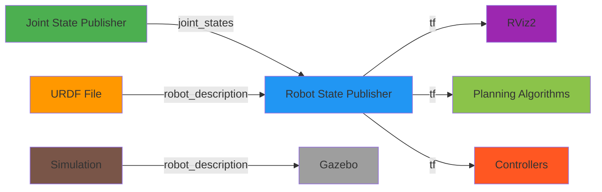

# Chapter 4: Robot Description with URDF

## Introduction

In the previous chapters, you learned how ROS 2 nodes communicate with each other through topics, services, and actions. Now we'll explore how to describe the physical structure of robots using URDF (Unified Robot Description Format).

URDF is essential for robotics applications because it provides a standardized way to describe a robot's physical properties: its links (rigid parts), joints (connections between parts), sensors, and other components. This description is crucial for simulation, visualization, motion planning, and control. In the context of Physical AI and humanoid robotics from Module 1, URDF allows us to represent the mechanical structure of robots in a way that ROS 2 tools can understand and work with.

By the end of this chapter, you'll understand how to create URDF files that describe robot structures, how to work with links and joints, and how URDF integrates with ROS 2 for simulation and control. You'll also learn about XACRO, a macro language that makes complex URDF files more manageable.

## Core Concepts

### Links and Joints

In URDF, a robot is described as a collection of **links** connected by **joints**:

- **Links** represent rigid parts of the robot (like a robot arm link, a wheel, or a sensor mount)
- **Joints** define how links are connected and how they can move relative to each other

This creates a kinematic chain that describes the robot's mechanical structure. The connections form a tree structure (no loops), with one link designated as the "base" or "root" of the robot.

### Coordinate Frames

URDF defines coordinate frames for each link, which is crucial for:
- Understanding the spatial relationship between different parts
- Performing transformations between different parts of the robot
- Integrating sensor data that's referenced to specific parts of the robot

Each link has its own coordinate frame (position and orientation), and joints define how these frames relate to each other.

### URDF vs XACRO

**URDF (Unified Robot Description Format)** is an XML-based format that directly describes robot structure. However, as robots become more complex, pure URDF files can become very long and difficult to maintain.

**XACRO (XML Macros)** is a preprocessor that adds macro capabilities to URDF:
- Variables and constants
- Mathematical expressions
- Macros (reusable components)
- Include statements for modular design

XACRO files are processed to generate final URDF files, making complex robot descriptions much more manageable.

### Role of URDF in Simulation and Control

URDF serves several critical functions in robotics:

- **Simulation**: Physics engines use URDF to simulate how the robot moves and interacts with the environment
- **Visualization**: Tools like RViz use URDF to display the robot in 3D
- **Motion Planning**: Planning algorithms use URDF to understand the robot's kinematic structure
- **Control**: Controllers use URDF to understand how joint movements affect the robot's configuration
- **Collision Detection**: URDF provides the geometric information needed for collision checking

## Examples

### Complete URDF for a 2-Link Robotic Arm

Here's a complete URDF example for a simple 2-link robotic arm:

```xml
<?xml version="1.0"?>
<robot name="simple_arm" xmlns:xacro="http://www.ros.org/wiki/xacro">
  <!-- Base link -->
  <link name="base_link">
    <visual>
      <geometry>
        <cylinder length="0.1" radius="0.1"/>
      </geometry>
      <material name="blue">
        <color rgba="0 0 0.8 1"/>
      </material>
    </visual>
    <collision>
      <geometry>
        <cylinder length="0.1" radius="0.1"/>
      </geometry>
    </collision>
    <inertial>
      <mass value="1"/>
      <inertia ixx="0.01" ixy="0" ixz="0" iyy="0.01" iyz="0" izz="0.01"/>
    </inertial>
  </link>

  <!-- First joint -->
  <joint name="joint1" type="revolute">
    <parent link="base_link"/>
    <child link="link1"/>
    <origin xyz="0 0 0.05" rpy="0 0 0"/>
    <axis xyz="0 0 1"/>
    <limit lower="-1.57" upper="1.57" effort="100" velocity="1"/>
  </joint>

  <!-- First link -->
  <link name="link1">
    <visual>
      <geometry>
        <box size="0.05 0.05 0.5"/>
      </geometry>
      <material name="red">
        <color rgba="0.8 0 0 1"/>
      </material>
    </visual>
    <collision>
      <geometry>
        <box size="0.05 0.05 0.5"/>
      </geometry>
    </collision>
    <inertial>
      <mass value="0.5"/>
      <inertia ixx="0.01" ixy="0" ixz="0" iyy="0.01" iyz="0" izz="0.001"/>
    </inertial>
  </link>

  <!-- Second joint -->
  <joint name="joint2" type="revolute">
    <parent link="link1"/>
    <child link="link2"/>
    <origin xyz="0 0 0.25" rpy="0 0 0"/>
    <axis xyz="0 1 0"/>
    <limit lower="-1.57" upper="1.57" effort="100" velocity="1"/>
  </joint>

  <!-- End effector link -->
  <link name="link2">
    <visual>
      <geometry>
        <sphere radius="0.05"/>
      </geometry>
      <material name="green">
        <color rgba="0 0.8 0 1"/>
      </material>
    </visual>
    <collision>
      <geometry>
        <sphere radius="0.05"/>
      </geometry>
    </collision>
    <inertial>
      <mass value="0.1"/>
      <inertia ixx="0.001" ixy="0" ixz="0" iyy="0.001" iyz="0" izz="0.001"/>
    </inertial>
  </link>
</robot>
```

### Visual and Collision Elements

URDF distinguishes between visual and collision elements:

**Visual elements** define how the robot appears in visualization tools:
- `<visual>` tags contain the visual representation
- Includes geometry, materials, and colors
- Used by RViz and simulation environments for display

**Collision elements** define the physical properties for collision detection:
- `<collision>` tags contain the collision geometry
- Used by physics engines for simulation
- May be simplified compared to visual geometry for performance

### XACRO Example

Here's the same robot described using XACRO to demonstrate how it makes complex descriptions more manageable:

```xml
<?xml version="1.0"?>
<robot name="simple_arm_xacro" xmlns:xacro="http://www.ros.org/wiki/xacro">

  <!-- Define constants -->
  <xacro:property name="M_PI" value="3.1415926535897931" />
  <xacro:property name="base_length" value="0.1" />
  <xacro:property name="base_radius" value="0.1" />
  <xacro:property name="link1_size_x" value="0.05" />
  <xacro:property name="link1_size_y" value="0.05" />
  <xacro:property name="link1_size_z" value="0.5" />
  <xacro:property name="link2_radius" value="0.05" />

  <!-- Macro for a simple box link -->
  <xacro:macro name="simple_box_link" params="name xyz size color">
    <link name="${name}">
      <visual>
        <origin xyz="${xyz}"/>
        <geometry>
          <box size="${size}"/>
        </geometry>
        <material name="color_mat">
          <color rgba="${color}"/>
        </material>
      </visual>
      <collision>
        <origin xyz="${xyz}"/>
        <geometry>
          <box size="${size}"/>
        </geometry>
      </collision>
      <inertial>
        <mass value="0.1"/>
        <inertia ixx="0.01" ixy="0" ixz="0" iyy="0.01" iyz="0" izz="0.01"/>
      </inertial>
    </link>
  </xacro:macro>

  <!-- Base link -->
  <link name="base_link">
    <visual>
      <geometry>
        <cylinder length="${base_length}" radius="${base_radius}"/>
      </geometry>
      <material name="blue">
        <color rgba="0 0 0.8 1"/>
      </material>
    </visual>
    <collision>
      <geometry>
        <cylinder length="${base_length}" radius="${base_radius}"/>
      </geometry>
    </collision>
    <inertial>
      <mass value="1"/>
      <inertia ixx="0.01" ixy="0" ixz="0" iyy="0.01" iyz="0" izz="0.01"/>
    </inertial>
  </link>

  <!-- First joint -->
  <joint name="joint1" type="revolute">
    <parent link="base_link"/>
    <child link="link1"/>
    <origin xyz="0 0 ${base_length/2}" rpy="0 0 0"/>
    <axis xyz="0 0 1"/>
    <limit lower="${-M_PI/2}" upper="${M_PI/2}" effort="100" velocity="1"/>
  </joint>

  <!-- First link using macro -->
  <link name="link1">
    <visual>
      <geometry>
        <box size="${link1_size_x} ${link1_size_y} ${link1_size_z}"/>
      </geometry>
      <material name="red">
        <color rgba="0.8 0 0 1"/>
      </material>
    </visual>
    <collision>
      <geometry>
        <box size="${link1_size_x} ${link1_size_y} ${link1_size_z}"/>
      </geometry>
    </collision>
    <inertial>
      <mass value="0.5"/>
      <inertia ixx="0.01" ixy="0" ixz="0" iyy="0.01" iyz="0" izz="0.001"/>
    </inertial>
  </link>

  <!-- Second joint -->
  <joint name="joint2" type="revolute">
    <parent link="link1"/>
    <child link="link2"/>
    <origin xyz="0 0 ${link1_size_z/2}" rpy="0 0 0"/>
    <axis xyz="0 1 0"/>
    <limit lower="${-M_PI/2}" upper="${M_PI/2}" effort="100" velocity="1"/>
  </joint>

  <!-- End effector link -->
  <link name="link2">
    <visual>
      <geometry>
        <sphere radius="${link2_radius}"/>
      </geometry>
      <material name="green">
        <color rgba="0 0.8 0 1"/>
      </material>
    </visual>
    <collision>
      <geometry>
        <sphere radius="${link2_radius}"/>
      </geometry>
    </collision>
    <inertial>
      <mass value="0.1"/>
      <inertia ixx="0.001" ixy="0" ixz="0" iyy="0.001" iyz="0" izz="0.001"/>
    </inertial>
  </link>
</robot>
```

### Working with URDF in ROS 2

To use URDF in ROS 2, you typically:

1. **Load the robot description parameter**:
   ```bash
   ros2 param set /robot_state_publisher robot_description --string "$(cat path/to/robot.urdf)"
   ```

2. **Use the robot_state_publisher node** to publish transforms:
   ```xml
   <node pkg="robot_state_publisher" exec="robot_state_publisher" name="robot_state_publisher">
     <param name="robot_description" value="$(find-pkg-share your_package)/urdf/robot.urdf"/>
   </node>
   ```

3. **Visualize in RViz** by adding a RobotModel display and setting the TF topic

### URDF and ROS 2 Integration

URDF integrates with ROS 2 through several packages:

- **robot_state_publisher**: Publishes transforms based on joint states
- **joint_state_publisher**: Publishes joint state messages (for visualization)
- **rviz2**: Visualizes the robot model in 3D
- **gazebo_ros_pkgs**: Loads URDF for physics simulation

### ROS Graph Visualization

Here's a visualization showing how URDF integrates with ROS 2:



In this diagram:
- Green: Joint State Publisher providing joint information
- Blue: Robot State Publisher computing and publishing transforms
- Orange: URDF File describing robot structure
- Purple: RViz2 for visualization
- Light Green: Planning Algorithms using robot structure
- Red: Controllers using robot structure
- Brown: Simulation environment
- Gray: Gazebo simulation using URDF

## Summary & Key Takeaways

In this chapter, you've learned about URDF (Unified Robot Description Format):

- **URDF** describes robot structure using links (rigid parts) and joints (connections)
- **Links and joints** form the kinematic chain that defines robot structure
- **Coordinate frames** are essential for spatial relationships and transformations
- **XACRO** extends URDF with macros, variables, and includes for complex robots
- **URDF serves** simulation, visualization, motion planning, and control

You've seen how to create complete URDF descriptions for robots, including visual and collision elements, and how URDF integrates with ROS 2 through packages like robot_state_publisher and RViz.

URDF is fundamental to robotics applications because it provides a standardized way to describe robot geometry and kinematics that ROS 2 tools can understand. This enables simulation, visualization, and control of robotic systems.

With all four chapters of Module 2 complete, you now have a comprehensive understanding of ROS 2 as the robotic nervous system, from basic architecture and setup to advanced communication patterns and robot description. This foundation prepares you for Module 3: Robot Modeling & Simulation Fundamentals, where you'll explore physics engines, sensor modeling, and how to create digital twins of your robotic systems.